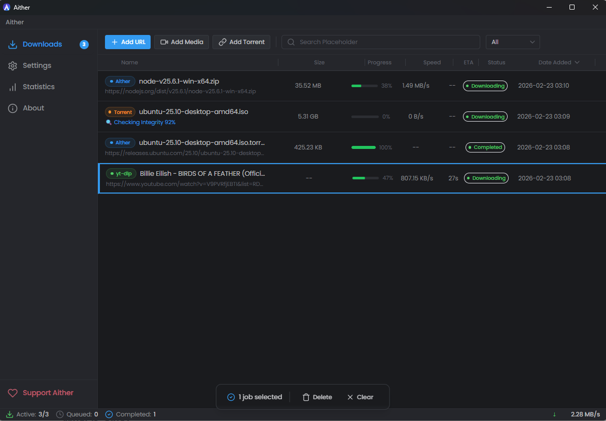
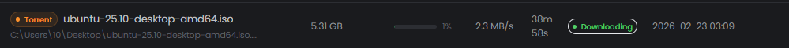
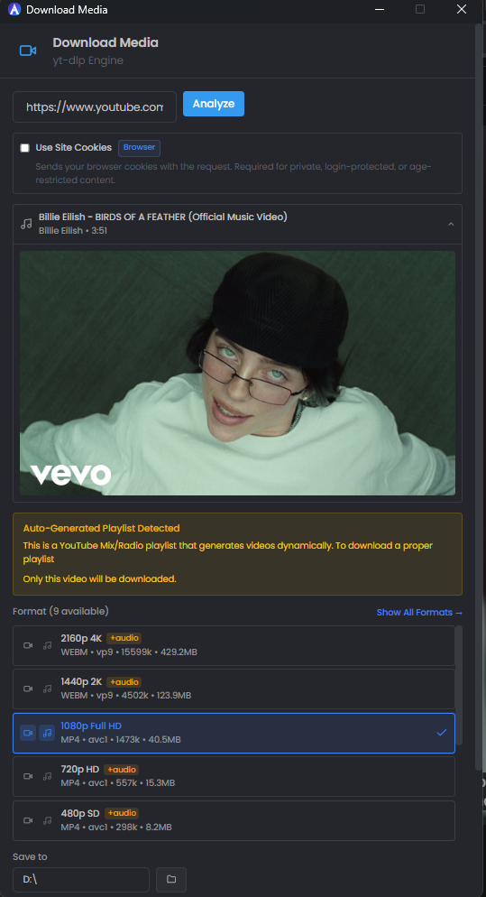
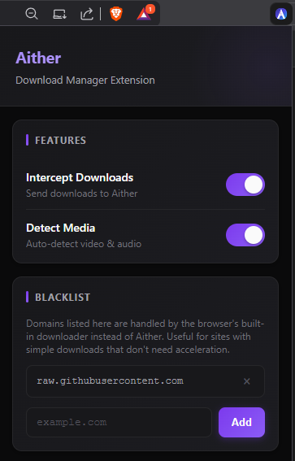
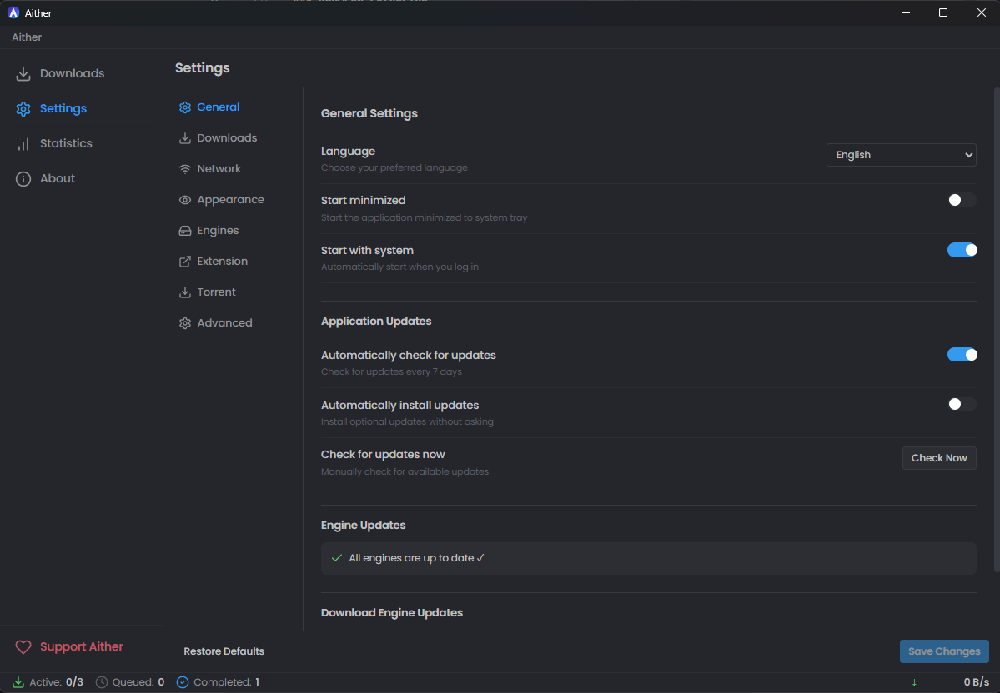

<div align="center">

<!--
  SCREENSHOT NOTE: Replace the line below with your actual app icon/logo.
  Recommended: a 128x128 or 256x256 PNG of the Aither icon.
  Example: 
-->


# Aither Download Manager

**Multi-connection download manager for Windows — 1000+ sites via yt-dlp, torrents via aria2, one-click browser download interception.**

[](https://github.com/NoahMustafa/Aither-Download-Manager/releases/latest)
[](https://github.com/NoahMustafa/Aither-Download-Manager/releases)
[](https://github.com/NoahMustafa/Aither-Download-Manager/stargazers)
[](https://github.com/NoahMustafa/Aither-Download-Manager/releases/latest)
[](LICENSE)
[](https://tauri.app)
[](https://www.rust-lang.org)
[](https://paypal.me/MahmoudMustafa186)
[](https://ko-fi.com/noah_mustafa_stuff)

[**Website**](https://aither-landing-page.pages.dev/) · [**Download**](https://github.com/NoahMustafa/Aither-Download-Manager/releases/latest) · [**Changelog**](CHANGELOG.md) · [**Report a Bug**](https://github.com/NoahMustafa/Aither-Download-Manager/issues/new?template=bug_report.yml) · [**Request a Feature**](https://github.com/NoahMustafa/Aither-Download-Manager/issues/new?template=feature_request.yml) · [**Discussions**](https://github.com/NoahMustafa/Aither-Download-Manager/discussions) · [**Buy me a coffee ☕**](https://ko-fi.com/noah_mustafa_stuff)

</div>

---

<!--
  SCREENSHOT NOTE: Replace the image below with a full-width screenshot of the main
  download list — ideally showing 2-3 active downloads with progress bars, speed, and ETA.
  Recommended size: 1280x800 or wider. Save as docs/assets/screenshot-main.png
-->



---

## What is Aither?

Aither is a free, freemium download manager that replaces your browser's built-in downloader with something far more capable. It intercepts downloads automatically, splits files into parallel connections for maximum speed, survives crashes without losing progress, and pulls videos and playlists from over 1000 websites, and ability to download torrents with up-to-date daily trackers — all from a clean, modern interface.

---

## Features

### Native Download Engine

- **Multi-connection parallel downloads** — splits files into chunks and downloads simultaneously
- **HTTP, HTTPS, FTP, and FTPS** support out of the box
- **Crash-resistant** — state is saved continuously; resume exactly where you left off after a crash or restart
- **Auto-retry** on network drops with intelligent backoff

### Media Downloads

- **1000+ supported sites** via yt-dlp — YouTube, Vimeo, Twitter/X, Reddit, Instagram, TikTok, Dailymotion, Twitch, and many more
- **Quality selector** — choose resolution, format, and audio tracks before downloading
- **Playlist support** — download entire playlists or channels in one go
- **Cookie-based authentication** — access private, login-protected, and age-restricted content using your browser session

### Browser Extension

- **Automatic download interception** — every download link in your browser is routed through Aither
- **In-page overlay button** — a download button appears directly on top of videos as you browse; no copy-pasting URLs
- **Blacklist** — exclude specific domains so the browser handles them natively

### Torrent

- **Torrent and magnet link support** via aria2c
- Configurable connections and speed limits per download

### General

- **Auto-update** — lightweight background updates without reinstalling
- **System tray** — runs quietly in the background, always available
- **Proxy support** — per-download or global proxy configuration
- **Speed limits** — set global or per-engine download caps
- **Clean reinstall tool (Nuke-Aither)** — standalone `.exe` that fully removes Aither for a fresh start, with an option to keep your download history
- **16 languages** — Arabic, Chinese, Dutch, English, French, German, Hindi, Indonesian, Italian, Japanese, Korean, Norwegian, Polish, Portuguese, Russian, Spanish, Swedish, Turkish

---

## Screenshots

<details>
<summary>Click to expand screenshots</summary>

<br>

<!--
  SCREENSHOT NOTE: A close-up of a single active download showing the progress bar,
  speed (MB/s), ETA, file name, and the pause/cancel buttons.
  Save as: docs/assets/screenshot-download-progress.png
-->

### Active Download



---

<!--
  SCREENSHOT NOTE: The yt-dlp analyzer/quality selector dialog that opens when a media
  URL is detected. Should show the format list (1080p, 720p, audio-only, etc.)
  and the "Use Site Cookies" checkbox.
  Save as: docs/assets/screenshot-media-analyzer.png
-->

### Media Quality Selector



---

<!--
  SCREENSHOT NOTE: A browser page (e.g. a video site) with the Aither overlay download
  button visible on top of a video thumbnail. Shows the extension in action.
  Save as: docs/assets/screenshot-overlay.png
-->

### In-Page Overlay Button


---

<!--
  SCREENSHOT NOTE: The browser extension popup showing the Features toggles
  (Intercept Downloads, Detect Media) and the Blacklist section.
  Save as: docs/assets/screenshot-extension-popup.png
-->

### Browser Extension



---

<!--
  SCREENSHOT NOTE: The Settings page inside the Aither app — showing speed limits,
  connection count, language selector, and proxy settings.
  Save as: docs/assets/screenshot-settings.png
-->

### Settings



</details>

---

## Installation

### Option 1 — MSI Installer (Recommended)

1. Download the **`.msi`** installer from the [latest release](https://github.com/NoahMustafa/Aither-Download-Manager/releases/latest)
2. Run the installer and follow the prompts
3. Aither launches automatically and appears in the system tray

### Option 2 — Portable

> Coming in a future release.

### Clean Reinstall / Full Reset

Stuck on a corrupted install, or just want to start completely fresh? Download **`Nuke-Aither.exe`** from the [latest release](https://github.com/NoahMustafa/Aither-Download-Manager/releases/latest) and run it. It fully removes Aither — app, settings, and leftover files — with an option to keep your download history. Reinstall the MSI afterward for a clean slate.

### System Requirements

|             | Minimum                         |
| ----------- | ------------------------------- |
| **OS**      | Windows 10 64-bit (build 1903+) |
| **RAM**     | 100 MB                          |
| **Disk**    | 200 MB                          |
| **Network** | Any                             |

---

## Browser Extension Setup

The browser extension enables automatic download interception and the in-page overlay button.

1. Install Aither — the extension files are bundled with the app and extracted automatically on first run
2. Open Chrome and go to `chrome://extensions`
3. Enable **Developer mode** (top-right toggle)
4. Click **Load unpacked** and select the folder:
   ```
   %LOCALAPPDATA%\Aither\extension\chrome
   ```
5. The Aither icon appears in your toolbar — you're done

> **Note:** The extension connects to the Aither app automatically. No manual configuration is required.

---

## How It Works

```
Browser / URL
     │
     ▼
Browser Extension ──intercepts──► Aither App
                                       │
                          ┌────────────┼────────────┐
                          ▼            ▼             ▼
                    Native Engine   yt-dlp        aria2c
                  (HTTP/FTP files) (media/video) (torrents)
                          │            │             │
                          └────────────┴─────────────┘
                                       │
                                  Downloaded File
```

- **Regular files** (`.zip`, `.exe`, `.pdf`, etc.) → Native engine with parallel chunks
- **Media URLs** (YouTube, Instagram, etc.) → yt-dlp with quality selection
- **Torrents / Magnets** → aria2c

---

## Built With

| Layer             | Technology                                                                |
| ----------------- | ------------------------------------------------------------------------- |
| Desktop framework | [Tauri](https://tauri.app)                                                |
| Backend / Engine  | [Rust](https://www.rust-lang.org) + [Tokio](https://tokio.rs)             |
| Frontend          | [React](https://react.dev) + [TypeScript](https://www.typescriptlang.org) |
| Database          | SQLite via [sqlx](https://github.com/launchbadge/sqlx)                    |
| Media downloads   | [yt-dlp](https://github.com/yt-dlp/yt-dlp)                                |
| Torrents          | [aria2c](https://aria2.github.io)                                         |
| Styling           | [Tailwind CSS](https://tailwindcss.com)                                   |

---

## How Aither Compares

|                                       | Aither             | Motrix             | omniget            | FileCentipede           |
| ------------------------------------- | ------------------- | ------------------- | ------------------- | ------------------------ |
| Platforms                             | Windows             | Cross-platform      | Cross-platform      | Cross-platform            |
| License                               | Free, proprietary   | Open source (MIT)   | Open source (GPL-3.0) | Free, source-available |
| Browser video-capture extension       | ✅                  | —                   | —                   | ✅                        |
| yt-dlp media downloads (1000+ sites)  | ✅                  | —                   | ✅                  | —                         |
| Torrent / magnet (aria2)              | ✅                  | ✅                  | —                   | ✅                        |
| Cookie-based private/login content    | ✅                  | —                   | —                   | ✅                        |

No single alternative combines all four rows: FileCentipede overlaps on browser capture and cookies, omniget overlaps on yt-dlp breadth, Motrix and FileCentipede overlap on torrents. Aither is the only one that pairs all three feature rows in a native Rust engine — and the only one of the four that isn't open source.

---

## Roadmap

- [ ] macOS and Linux support
- [ ] Firefox extension
- [ ] Scheduler (download at specific times)
- [ ] Browser extension for Edge and Firefox
- [ ] Batch URL import
- [ ] Post-download actions (extract, run, etc.)

---

## Privacy & Your Data

**Aither does not collect, upload, or share any of your data.** Everything stays on your machine.

### Cookies

When you enable "Use Site Cookies" for a media download, your browser sends the cookies for that site to Aither — the same way your browser would send them to the website itself. Aither uses them **only** to authenticate the download request (so yt-dlp can access private or login-protected content). They are never sent anywhere else.

Here is exactly what happens to your cookies, step by step:

1. **Received** from the browser extension over a local connection — no internet involved
2. **Encrypted immediately** using AES-256-GCM with a key derived from your machine's hardware ID. This means the encrypted file is tied to your specific machine and cannot be decrypted on any other computer
3. **Written to a temporary file** on your local disk (under `%APPDATA%\Aither\cookies\`) only for the duration of the download
4. **Passed to yt-dlp** via the standard `--cookies` flag on your local machine
5. **Deleted** after the download completes

### Logs

Application logs are encrypted in production builds using a hybrid RSA-2048 + AES-256-GCM scheme. Before encryption, all sensitive values (cookies, tokens, passwords, session IDs) are **automatically redacted** and replaced with `[REDACTED]` — so even the encrypted log file never contains your actual cookie values.

### What Aither Does Contact the Internet For

The **only** external contact Aither makes is to **GitHub**, and only for:

- Checking for application updates (`github.com/NoahMustafa/Aither-Download-Manager`)
- Downloading updated versions of bundled tools (yt-dlp, aria2c, ffmpeg) from their official GitHub releases

No user data, download history, machine information, or analytics are included in any of these requests.

### Summary

| Data              | Stored                             | Encrypted                    | Uploaded |
| ----------------- | ---------------------------------- | ---------------------------- | -------- |
| Your cookies      | Temporarily, locally               | Yes — AES-256-GCM            | Never    |
| Your downloads    | Locally (your chosen folder)       | No                           | Never    |
| Application logs  | Locally (`%APPDATA%\Aither\logs\`) | Yes — RSA-2048 + AES-256-GCM | Never    |
| Usage / analytics | Not collected                      | —                            | Never    |

---

## Support the Project

Aither is **completely free** — no ads, no subscriptions, no paywalls, no profit motive. Every feature is available to every user at no cost.

If Aither saves you time and you'd like to say thanks, a small donation helps cover the cost of keeping the project alive: tooling, and continued development. It is entirely optional and never expected.

<div align="center">

[](https://paypal.me/MahmoudMustafa186)
[](https://ko-fi.com/noah_mustafa_stuff)

</div>

> Donating does not unlock any features — everything is already free. It simply helps keep the lights on.

---

## Acknowledgements

Aither would not be possible without these incredible open source projects:

- **[yt-dlp](https://github.com/yt-dlp/yt-dlp)** — the powerful media extraction engine behind Aither's video and audio downloads. A massive thanks to the yt-dlp team and all its contributors for maintaining support for 1000+ sites and keeping it free for everyone.

- **[aria2](https://github.com/aria2/aria2)** — the lightweight, high-performance download utility that powers Aither's torrent and magnet link support. Thank you to the aria2 team for building such a reliable and capable tool.

- **[FFmpeg](https://ffmpeg.org)** — the industry-standard multimedia framework used for merging and converting media streams. Thank you to the FFmpeg project and its contributors.

These projects are distributed under their respective open source licenses. Aither bundles their binaries solely for user convenience — all credit belongs to their respective authors and communities.

---

## Star History

<a href="https://star-history.com/#NoahMustafa/Aither-Download-Manager&Date">
  
</a>

---

## Contributing

Aither's source is proprietary, so PRs changing app behavior aren't accepted — but bug reports, feature requests, and translation fixes are welcome and directly shape the roadmap. See [CONTRIBUTING.md](CONTRIBUTING.md) for how to file one, or use [Discussions](https://github.com/NoahMustafa/Aither-Download-Manager/discussions) for anything else.

Found a security issue? Do not open a public issue — see [SECURITY.md](SECURITY.md) for how to report it privately.

---

## License

Aither is **free to use** but **not open source**. The source code is proprietary and may not be copied, modified, redistributed, or used to build derivative products without explicit written permission from the Aither Team. Full terms, the content/copyright notice, and the disclaimer are in [LICENSE](LICENSE).

**What you can do:** download and use Aither for personal or commercial purposes at no cost; report bugs and suggest features.

**What you cannot do:** redistribute, repackage, or resell Aither or its components; decompile, reverse engineer, or modify the application; use the source code or assets in other projects.

---

<div align="center">
  <sub>Built with care by the Aither Team</sub>
</div>
